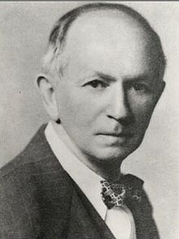

```{r knitr2, echo=FALSE}
knitr::opts_chunk$set(
  eval      = TRUE,
  comment   = "#",
  results   = "hold",
  message = FALSE,
  warning = FALSE,
  # collapse  = TRUE,
  fig.align = "center")
#library(png) 
library(jpeg)
#library(knitr)
```

# Generalized Lotka-Volterra {#intro}

## History
```{r, lotka, echo=FALSE,out.width = "25%"}
# All defaults

```

Alfred J. Lotka (1880-1949) was born to French-speaking American parents in Lemberg (then part of the Habsburg empire, now Lviv, Ukraine). He studied in France, Germany and England, receiving a BSc in 1901 and a DSc in 1912 from Birmingham university. He moved to the US in 1902, and worked at the US Patent office, as an editor of Scientific American, and as a statistician at the Metropolitan Life Insturance Company in NYC. He wrote more than a hundred papers and five books, spanning a large range of topics. He's best known for the book *Elements of Physical Biology*, his contributions to demography, and one of the first studies dealing with bibliometrics [@lotka1926frequency]. 

Starting in 1910 (reprinted as @lotka2002contribution) he investigated coupled differential equations relating to chemical as well as ecological dynamics. In @lotka1920analytical he studied a system of two ODEs that gave rise to perpetual oscillations: *"It was, therefore, with considerable surprise that the writer, on applying his method to certain special cases, found these to lead to undamped, and hence indefinitely continued, oscillations."* He went on to describe *"1. A species of organism $S_1$, a plant species, say, deriving its nourishment from a source presented in such large excess that the mass of the source may be considered constant during the period of time with which we are concerned. 2. A species $S_2$, for example a herbivorous animal species, feeding on $S_1$."* 

The equations he had derived (and then studied later in more detail) are now termed Lotka-Volterra equations.

```{r, volterra, echo=FALSE,out.width = "25%"}
# All defaults
knitr::include_graphics("images/Volterra.jpg")
```

Vito Volterra (1860-1940) was born in Ancona (then part of the Papal State) in a poor jewish family. The financial situation precipitated with the death of his father, when Vito was two. Vito and his mother went to live with relatives in Turin and then Florence. Volterra showed amazing mathematical talent at a very young age. Antonio Roiti, professor of physics in Florence, noticed the budding mathematician and hired him as his assistant, so that he could continue his studies. He went on to enroll at the Scuola Normale in Pisa, receiving a degree in Physics in 1882. At age 23 he was made full professor of Rational Mechanics in Pisa, and then in 1900 of Mathematical Physics in Rome. For thirty years, he contributed important studies in mathematics, and enriched academic life in Italy (for example, he was the first director of the National Center for Research). In 1931 he refused to take an oath of loyalty to the fascist regime (only 12 professors out of 1250 refused), and was therefore forced to resign (his take on the fascist enterprise: *"Empires die, but Euclid's theorems keep their youth forever"*). 

His interest in mathematical ecology is due to Umberto D'Ancona (his son-in-law), who had studied the trends in fisheries in the Adriatic sea before and immediately after WWI. In 1914-1918 fisheries in the Adriatic had stopped completely because of the conflict. D'Ancona had noticed that, while herbivorous fish had remained about constant, the piscivorous fish had increased dramatically in numbers. The problem piqued Volterra who immediately published a sophisticated study, proposing the same equations studied by Lotka. In a short letter to Nature [@volterra1926fluctuations], he stated the so-called "Volterra's Effect" (which he termed "Law III"): *"a complete closure of the fishery was a form of 'protection' under which the voracious fishes were much the better and prospered accordingly, but the ordinary food-fishes, on which these are accustomed to prey, were worse off than before."* This brief paper was a summary of the much extensive @volterra1926variazioni.

### Lotka-Volterra interactions

In 1927, Lotka wrote to Nature to raise the issue that the equations studied by Volterra and the figures presented in Volterra's brief article were identical to those found in *Elements of Physical Biology* (published in 1925). He concluded: *"It would be gratifying if Prof. Volterra's publication should direct attention to a field and method of inquiry which apparently has hitherto passed almost unnoticed."*

Volterra graciously conceded *"I recognize his priority, and am sorry not to have known his work, and therefore not have been able to mention it."* He however listed a few points in which the two authors had pursued different directions, and concluded *"Working independently the one from the other, we have found some common results, and this confirms the exactitude and the interest in the position of the problem. I agree with him in his conclusions that these studies and these methods of research deserve to receive greated attention from scholars, and should give rise to important applications."*

## Basic formulation

We can write the Generalized Lotka-Volterra model in a compact form as:

$$
\dfrac{dx(t)}{dt} = D(x(t))(r + A x(t))
$$

where $x(t)$ is a (column) vector of length $n$ containing the densities of all populations $1, \ldots, n$ at time $t$, $r$ is a vector of "intrinsic growth rates" (or death rates, when negative), measuring the growth (decline) of population $i$ when grown alone at low density, and $A$ is a $n \times n$ matrix of interaction coefficients. We use $D(x)$ to denote the diagonal matrix with $x$ on the diagonal. 

## A single population

The simplest case to study is that of a single population, in which case the equation becomes that of the logistic growth:

$$
\dfrac{dx(t)}{dt} = x(t)(r + a x(t))
$$

This is a separable ODE, with solution:

$$
x(t) = \frac{r}{e^{-r \left(k+t\right)}-a}
$$
where $k$ is a constant. Setting $x(0) = x_0$ (i.e., providing an initial condition), solving for the constant and substituting, we obtain:

---
# Notes on derivation
# k -> log(x0 / (r + a x0)) / r + k2
# set k2 to zero
# backsubstitute
---

$$
x(t) = \frac{r {x_0} e^{r t}}{r-a {x_0} \left(e^{r t}-1\right)}
$$
As such, provided with the parameters $r$ and $a$, as well as an initial condition, we can determine the population size for any time $t$. For example, in `R`:

```{r, logistic}
library(deSolve) # integrate ODEs
library(tidyverse) # plotting and wrangling
# define the differential equation
logistic_growth <- function(t, x, parameters){
  with(as.list(c(x, parameters)), {
    dxdt <- x * (r + a * x)
    list(dxdt)
  })
}
# define parameters, integration time, initial conditions
times <- seq(0, 100, by = 5)
x0 <- 0.05
r <- 0.1
a <- -0.05
parameters <- list(r = r, a = a)
# solve numerically
out <- ode(y = x0, times = times, 
           func = logistic_growth, parms = parameters, 
           method = "ode45")
# now compute analytically
solution <- r * x0 * exp(r * times) / (r - a * x0 * (exp(r * times) - 1))
# use ggplot to plot
res <- tibble(time = out[,1], x_t = out[,2], x_sol = solution)
ggplot(data = res) + aes(x = time, y = x_t) + 
  geom_line() + 
  geom_point(aes(x = time, y = x_sol), colour = "red", shape = 2) + 
  ylab(expression("x(t)")) + xlab(expression("t"))
```

If $a < 0$ and $r > 0$, the population started at any positive value eventually reaches an equilibrium, which we can find by setting $dx(t)/dt = 0$ and considering $x \neq 0$:

$$
(r + a x) = 0 \to x = -\frac{r}{a}
$$

### Metapopulation dynamics

Consider a fragmented landscape in which habitable patches are connected by dispersal (for simplicity, suppose that all patches are reachable from any other). Call $p(t)$ the proportion of patches occupied by the species of interest at time $t$, and assume that a) an empty patch (the proportion of empty patches is $1 - p(t)$) is colonized by the species with rate $c p(t)$, where $c$ is the "colonization rate", and b) that occupied patches become empty at rate $e p(t)$ ("extinction rate"). We want to model the proportion of patches occupied by the population at time $t$ [@levins1969some]:

$$
\dfrac{d p(t)}{dt} = c p(t)(1 - p(t)) - e p(t) = p(t) (c - (c + e) p(t))
$$

which is equivalent to the logistic equation above with $r = c$ and $a = -(c+e)$. As such, asymptotically the proportion of patches occupied by the population will be $-r/a = c / (c + e)$.

### S-I-S model

Consider a population of individuals, each of which can be in one of two states: susceptible to a disease, or infective/infected. Call $S(t)$ the proportion of susceptible individuals at time $t$, and $I(t)$ the proportion of infected individuals, with $S(t) + I(t) = 1$. When individuals meet, an infected individual can transmit the disease to susceptibles with rate $\beta$; infected individuals recover from the disease with rate $\gamma$, and return susceptible. We can write the system of equations:

$$
\begin{cases}
\dfrac{d S(t)}{dt} = -\beta S(t) I(t) + \gamma I(t)\\
\dfrac{d I(t)}{dt} = \beta S(t) I(t) - \gamma I(t)
\end{cases}
$$

take the second equation, and substitute $S(t) = 1 - I(t)$; rearranging:

$$
\dfrac{d I(t)}{dt} = \beta (1-I(t)) I(t) - \gamma I(t) = I(t)(\beta - \gamma -\beta I(t))
$$

which is again the equation for the logistic growth with $r = \beta - \gamma$ and $a = -\beta$. As such, provided that $\beta -\gamma > 0$, asymptotically a fraction $(\beta - \gamma) / \beta$ of individuals will be infected. The condition $\beta -\gamma > 0 \to \beta > \gamma \to \beta/ \gamma > 1$ is often written as $\mathcal R_0 = \beta/ \gamma > 1$.

## Multi-species dynamics

### Existence of an equilibrium

Returning to the multi-species system, and in analogy with the single species, we can look for stationary points (equilibria). If the matrix $A$ is not singular, then we can look for a solution of $r + Ax$ that has positive components (called a **feasible equilibrium**). **If such point exists, it is unique** and is the solution of $Ax^\star = -r$, $x^\star = -A^{-1}r$. 

Suppose that the GLV has no feasible equilibrium. Then all trajectories (if bounded; some could grow to infinity) reach the boundary of $\mathbb R^n_{0+}$. Practically, this means that **to ensure coexistence of all species, it is necessary to have an equilibrium in the interior $\mathbb R^n_{+}$**. 

For a proof, see Theorem 5.2.1 in @hofbauer1998evolutionary.

### Stability of an equilibrium

Suppose that a feasible equilibrium $x^\star$ exists. Then we can ask whether it is **attractive**, i.e. if trajectories started at initial condition $x(0)$ will eventually reach $x^\star$. This problem is in general difficult to solve (but see below); as an alternative, we can test for **local asymptotic stability**, i.e., ask whether **the system will return to the equilibrium if perturbed infinitesimally away from it**. In general, whenever we describe an ecological community as a system of nonlinear, autonomous ODEs:

$$
\frac{d x_i (t)}{d t} = f_i (x(t)) \;,
$$
we define an equilibrium $x^\star$ as a vector of densities such that:

$$
\left. \frac{d x_i}{d t} \right|_{{x}^\star} = f_i
({x}^\star) = 0 \quad \forall i
$$
A given system might have a multitude of equilibria. When the system is resting at an equilibrium point, it will remain there unless it is perturbed away from it. Local stability analysis is a method to probe whether a system that is perturbed infinitesimally away from an equilibrium will eventually return to it, or rather move away from it. 

Suppose that the system is resting at an equilibrium $x^\star$, and that it is slightly perturbed away from it. $\Delta x(0) = x(0)-x^\star$ is the state of the system immediately after the perturbation. We Taylor-expand around $x^\star$:

$$
f(\Delta x(0)) = f(x^\star)+ \left. J \right|_{x^\star} \Delta x(0) + \ldots
$$

Where $J$ is the Jacobian matrix of the system, whose elements are defined as:

$$
J_{ij} = \frac{\partial f_i({x})}{\partial x_j} 
$$

Each element of this matrix is therefore a function, whose value depends on ${x}$. When we evaluate the Jacobian matrix at an equilibrium point ${x}^\star$, we obtain the so-called "community matrix" ${M}$:

$$
  M = \left. {J} \right|_{ {x}^\star}
$$

Note that, although each system has a unique Jacobian matrix, there are as many community matrices as there are equilibria. The community matrix details the effect of increasing the density of one species on any other species around the equilibrium point.

We can therefore write the differential equation:

$$
\frac{d \Delta x(t)}{dt} \approx M \Delta x(t)
$$
with solution:

$$
\Delta x(t) = \Delta x(0) e^{Mt} = \Delta x(0) Q e^{\Lambda t} Q^{-1}
$$

Where $Q$ is the matrix containing the (unit) eigenvectors of $M$, and $\Lambda$ is a diagonal matrix containing the eigenvalues of $M$. As such, the eigenvalues of $M$ determine the stability of the equilibrium ${x}^\star$: if all the eigenvalues have negative real part, then the system will eventually return to the equilibrium after sufficiently small perturbations; conversely, if any of the eigenvalues have positive real part, the system will move away from the equilibrium whenever perturbed. Therefore, depending on the sign of the "rightmost" eigenvalue of ${M}$, $\lambda_1$, we can determine the stability of ${x}^\star$:

$$
  \text{Re}(\lambda_1) \begin{cases}
    < 0 \to {x}^\star \quad \text{is stable}\\
    > 0 \to {x}^\star \quad \text{is unstable}
  \end{cases}
$$

Local asymptotic stability means that the equilibrium is stable with respect to infinitesimal perturbations ("local"), and that returning to the equilibrium could take a long time ("asymptotic"). Ecologists have also studied stronger forms of stability (e.g., "global stability", in which all trajectories started at positive densities lead to the equilibrium). 

For the GLV model, the Jacobian is easy to compute:

$$
J_{ij} = \frac{\partial f_i}{\partial x_j} = a_{ij} x_i
$$

and 

$$
J_{ii} = \frac{\partial f_i}{\partial x_i} = r_i + \sum_j a_{ij} x_j + a_{ii} x_i
$$

At equilibrium $r_i + \sum_j a_{ij} x_j = 0$, and therefore:

$$
M = \left. {J} \right|_{ {x}^\star} = D(x^\star)A
$$

### Types of dynamics

For a single population, there are only three types of dynamics that can be displayed by a GLV model: either the population grows to infinity, shrinks to zero, or asymptotically reaches a steady state. 

@smale1976differential and @hirsch1982systems showed that limit cylces are possible for three or more species, and that any dynamics can be found for competitive GLV systems with five or more species.

The code necessary for some numerical explorations:

```{r, glvfunctions}
# Generalized Lotka-Volterra model
GLV <- function(t, x, parameters){
  with(as.list(c(x, parameters)), {
    x[x < 10^-8] <- 0 # prevent numerical problems
    dxdt <- x * (r + A %*% x)
    list(dxdt)
  })
}
# function to plot output
plot_ODE_output <- function(out){
  out <- as.data.frame(out)
  colnames(out) <- c("time", paste("sp", 1:(ncol(out) -1), sep = "_"))
  out <- as_tibble(out) %>% gather(species, density, -time)
  pl <- ggplot(data = out) + 
    aes(x = time, y = density, colour = species) + 
    geom_line()
  show(pl)
  return(out)
}
# general function to integrate GLV
integrate_GLV <- function(r, A, x0, maxtime = 100, steptime = 0.5){
  times <- seq(0, maxtime, by = steptime)
  parameters <- list(r = r, A = A)
  # solve numerically
  out <- ode(y = x0, times = times, 
           func = GLV, parms = parameters, 
           method = "ode45")
  # plot and make into tidy form
  out <- plot_ODE_output(out)
  return(out)
}
```

A few examples taken from @barabas2016effect. First, a competitive system in which a feasible equilibrium does not exist, leading to the extinction of a species:

```{r, glvex1}
set.seed(1) # for reproducibility
r_1 <- rep(1, 3)
A_1 <- -matrix(c(10, 9, 5, 
                 9, 10, 9, 
                 5, 9, 10), 3, 3, byrow = TRUE)
# check the existence of feasible equilibrium
print(solve(A_1, -r_1)) # not feasible
x0_1 <- runif(3)
res_1 <- integrate_GLV(r_1, A_1, x0_1)
```

Then, a case in which the equilibrium exists, and is attractive (stable):

```{r, glvex2}
set.seed(2) # for reproducibility
r_2 <- rep(10, 3)
A_2 <- -matrix(c(10, 7, 12, 
                 15, 10, 8, 
                 7, 11, 10), 3, 3, byrow = TRUE)
# check the existence of feasible equilibrium
print(solve(A_2, -r_2)) # feasible
x0_2 <- runif(3)
res_2 <- integrate_GLV(r_2, A_2, x0_2)
```

With three competitors we can find stable limit cycles:
```{r, glvex3}
set.seed(3) # for reproducibility
r_3 <- rep(1, 3)
A_3 <- -matrix(c(10, 6, 12, 
                 14, 10, 2, 
                 8, 18, 10), 3, 3, byrow = TRUE)
# check the existence of feasible equilibrium
print(solve(A_3, -r_3)) # feasible
x0_3 <- 0.1 * runif(3)
res_3 <- integrate_GLV(r_3, A_3, x0_3, maxtime = 250)
```

And with four or more species we can have chaos:
```{r, glvex4}
set.seed(4) # for reproducibility
r_4 <- c(1, 0.72, 1.53, 1.27)
A_4 <- -matrix(c(1, 1.09, 1.52, 0, 
                 0, 0.72, 0.3168, 0.9792, 
                 3.5649, 0, 1.53, 0.7191,
                 1.5367, 0.6477, 0.4445, 1.27), 4, 4, byrow = TRUE)
# check the existence of feasible equilibrium
print(solve(A_4, -r_4)) # feasible
x0_4 <- 0.1 * runif(4)
res_4 <- integrate_GLV(r_4, A_4, x0_4, maxtime = 500)
```

### The equilibrium is the time-average

Suppose that $x(t)$ has a periodic orbit of period $T$ (we assume $x(0) = x(T)$). Further, assume that the GLV has an interior equilibrium $x^\star$. We want to calculate the average density for each species:

$$
\frac{1}{T} \int_0^T x(t) dt
$$

We perform the change of variable $y = \log(x(t))$, finding $\frac{d x(t)}{dt} = \frac{d x(t)}{d \log(x(t))}\frac{d \log(x(t))}{dt} = x(t)\frac{d \log(x(t))}{dt}$. Then:

$$
\frac{d \log(x(t))}{dt} = r + Ax(t)
$$

Compute the average on both sides:

$$
\frac{1}{T}\int_0^T \frac{d \log(x(t))}{dt} dt= \frac{1}{T}\int_0^T \left(r + Ax \right) dt
$$

yielding:
$$
\frac{1}{T}(\log(x(T)) - \log(x(0))) = 0 = r + A \left( \frac{1}{T} \int_0^T x(t) dt \right)
$$
multiplying by the matrix inverse and rearranging:

$$
-A^{-1} r = x^\star =  \frac{1}{T} \int_0^T x(t) dt 
$$

showing that **the average density is** in fact **the equilibrium**. With a similar argument, one can prove that if the trajectory stays in a compact space (i.e., in case of chaotic attractors), then long-time average is still $x^\star$.

For example, let's compute the average for the system with the limit cycle above (discarding the transients in the first part of the time series):
```{r, timeavg1}
res_3 %>% filter(time > 50) %>% 
  group_by(species) %>% 
  summarize(average = mean(density))
# compare with equilibrium
solve(A_3, -r_3)
```

Repeat for the chaotic system:
```{r, timeavg2}
res_4 %>% filter(time > 50) %>% 
  group_by(species) %>% 
  summarize(average = mean(density))
# compare with equilibrium
solve(A_4, -r_4)
```

### Lyapunov diagonal stability and global stability

Suppose that there is a positive diagonal matrix $C$ such that $C A + A^t C$ is negative definite (i.e., has only negative eigenvalues; the eigenvalues are real because the matrix is symmetric).  Then $A$ is **Lyapunov-diagonally stable**. If this is the case, then $A$ is stable, and any $D A$ with $D$ positive is also stable (called $D-$stability).

Further, suppose that the GLV system with parameters $A$ and $r$ has a feasible equilibrium point $x^\star$. Then the function:

$$
V(x(t)) = 1^t D(y) \left( x(t) -D(x^\star) \log x(t)\right)
$$
is a Lyapunov function for the GLV system. 

To prove this point, we start from $r = -Ax^\star$. Substituting, we can write the GLV system as $dx(t)/dt = D(x)A(x - x^\star)$; similarly, we can write $d \log x(t)/dt = A(x - x^\star)$. Taking the derivative of $V$ with respect to time:

$$
\begin{aligned}
 \frac{d V(x(t))}{dt} &= 1^t C \left(\frac{d x(t)}{dt}  + D(x^*) \frac{d \log x(t)}{dt} \right)\\
 &= 1^t C \left(A (x - x^\star)  + D(x^*) A (x - x^\star) \right)\\
 &= 1^t C \left(D(x - x^\star)  A (x - x^\star) \right)\\
 &= 1^t \left(D(x - x^\star)  C A (x - x^\star) \right)\\
 &= (x - x^\star)^t  CA (x - x^\star)\\
 &= \frac{1}{2}(x - x^\star)^t  (CA + A^t C) (x - x^\star)\\
\end{aligned}
$$

A matrix $B$ is negative definite if $y^t B y < 0$ for all $y \neq 0$. As such $\frac{d V(x(t))}{dt} \leq 0$, i.e., will decrease in time (starting from any $x(0)$) until the equilibrium $x^\star$ is reached. 

The results above show that **if $A$ is Lyapunov diagonally-stable and a feasible equilibrium $x^\star$ exists, than all trajectories starting at a positive density will converge to the equilibrium**. This property is often used to prove **global stability**.

A simple numerical example with two species:

```{r, globalst2}
r <- c(1, 1)
A <- matrix(c(-1, 3/2, -1/2, -1), 2, 2)
# the eigenvalues of A + A^t are -1 and -3, hence A is Lyapunov Diagonally-stable
eigen(A + t(A))$values
# now integrate from random initial condition---this should always 
# converge to the equilibrium
solve(A, -r)
res <- integrate_GLV(r, A, abs(rnorm(2)))
res <- integrate_GLV(r, A, abs(rnorm(2)))
```

## Stability of large random communities

As we have seen above, an equilibrium $x^\star$ is stable if the community matrix for the equilibrium has all eigenvalues with negative real part. In general, to determine the equilibrium and its stability, we would need to specify all the growth rates ($r$, $n$ values), as well as the matrix of interactions ($A$, $n^2$ values). This is impractical to do for large systems (though we will try this out later). But can something quite general be said about the limit in which many species are in the community?

@may1972will attempted to answer this question by considering a **random community matrix**. In a GLV system, the diagonal elements $m_{ii} = a_{ii} x_i^\star$ are influenced by self-regulation (i.e., as in a carrying capacity), while the off-diagonal elements $m_{ij} = a_{ij} x_i^\star$ model the effect of species $j$ on the equilibrium of species $i$. May considered the following algorithm to build a random community matrix. Take a large community, resting at an unspecified, feasible equilibrium; we build the community matrix by setting:

- $m_{ij} = 0$  with probability $(1-C)$; with probability $C$ we draw $m_{ij}$ from a distribution with mean zero and variance $\sigma^2$. $C$ is the proportion of realized connections, termed the "connectance" of the system.
- the diagonal elements are set to $-d$, modeling self-regulation.

For example, the code uses a normal distribution:
```{r, buildmay}
build_May_normal <- function(n, C, d, sigma){
  # fill the whole matrix
  M <- matrix(rnorm(n * n, mean = 0, sd = sigma), n, n)
  # remove connections 
  M <- M * matrix(runif(n * n) <= C, n, n)
  # set diagonals
  diag(M) <- -d
  return(M)
}
```

Note that the average of the eigenvalues of a matrix $A$ is given by the average of its diagonal elements $\frac{1}{n}\sum_i \lambda_i = \frac{1}{n} \text{Tr}(A) = \frac{1}{n} \sum_i A_{ii}$. As such, if $A = dI + B$, the eigenvalues of $A$ will be those of $B$ shifted by $d$.

We want to determine whether the equilibrium will be stable, given $n$, $C$, $d$ and $\sigma^2$. To do so, we need to find the location of the "rightmost" eigenvalue of $M$. For example, let's plot the eigenvalues of a large matrix:
```{r, exmay}
plot_eigenvalues <- function(M, prediction = NULL){
  eig <- eigen(M, only.values = TRUE)$values
  dt <- tibble(Real = Re(eig), Imaginary = Im(eig))
  pl <- ggplot(dt) + aes(x = Real, y = Imaginary) + 
    geom_point() + 
    coord_equal() + 
    geom_vline(xintercept = 0, colour = "red", linetype = 2)
  if (is.null(prediction) == FALSE) {
    pl <- pl + geom_vline(xintercept = prediction, colour = "black", linetype = 2)
  }
  show(pl)
}
set.seed(100) # for reproducibility
# parameters
n <- 500
C <- 0.5
d <- 10
sigma <- 1
M <- build_May_normal(n, C, d, sigma)
plot_eigenvalues(M)
```

The eigenvalues fall into an almost perfect circle! Turns out, that this is the behavior we should expect, as stated by the so-called "Circular Law", one of the most beautiful results in random matrix theory. 

**Circular law:** Take a non-symmetric, $S \times S$ random matrix in which all coefficients $X_{ij}$ are i.i.d. random variables with $\mathbb E[X_{ij}] = 0$ and $\mathbb E[X_{ij}] = 1$. Then, as $S \to \infty$, the e.s.d. of ${X} / \sqrt{S}$ converges to the circular law:

$$
  \mu(\lambda) = \begin{cases}
    \frac{1}{\pi} \; \; \; \text{if} \; (\text{Re}(\lambda))^2 +
    (\text{Im}(\lambda))^2 \leq 1\\
    0 \; \; \;\text{ otherwise}.
  \end{cases}
$$

This result can be used to calculate the radius of the eigenvalue distribution of the matrices studied by May: when the off-diagonal coefficients $M_{ij}$ are 0 with probability $1-C$ and are sampled independently from a distribution with mean $0$ and variance $\sigma^2$ with probability $C$, we have that $\mathbb E[M_{ij}] = 0$ and $\mathbb E[M_{ij}^2] = C \sigma^2$. This means that if we were to divide the coefficients of ${M}$ by $\sqrt{C \sigma^2}$ we would recover the unit variance, and the matrix would follow the circular law when $S$ is large. Armed with this, we can calculate the radius: if the radius of ${M} / \sqrt{S C \sigma^2}$ converges to 1 when the matrix is large, then the radius of ${M}$ is approximately $\sqrt{S C \sigma^2}$. For stability, we need a sufficiently negative diagonal (setting the center of the circle), yielding May's stability criterion:

$$
\sqrt{S C \sigma^2} < d
$$

We can try this on our matrix:

```{r, maycrit}
prediction <- sqrt(n * C * sigma^2) - d
plot_eigenvalues(M, prediction)
```

Showing that we accurately approximate the location of the rightmost eigenvalue. Note that, in the case of large $n$, whenever the circle crosses zero, some eigenvalues will be positive, determining the instability of the equilibrium.

Importantly, the distribution from which the coefficients are sampled does not matter---only that the mean is zero and that the variance is $\sigma^2$. For example, build the matrix using coefficients from a uniform distribution:

```{r, exmay2}
build_May_uniform <- function(n, C, d, sigma){
  # fill the whole matrix (sqrt(3) to ensure var = sigma^2)
  M <- matrix(runif(n * n, min = -sqrt(3) * sigma, max = sqrt(3) * sigma), n, n)
  # remove connections 
  M <- M * matrix(runif(n * n) <= C, n, n)
  # set diagonals
  diag(M) <- -d
  return(M)
}
# parameters
n <- 500
C <- 0.5
d <- 10
sigma <- 1
M <- build_May_uniform(n, C, d, sigma)
prediction <- sqrt(n * C * sigma^2) - d
plot_eigenvalues(M, prediction)
```

This property is called **universality** in random matrix theory.

In ecological communities, the effect of species $i$ on $j$ and that of $j$ on $i$ are typically not independent (as assumed above): in the case of competition between species, we expect them both to be negative; for consumption, if one is positive, the other is negative, and so forth. A more refined model of a random matrix would therefore sample interactions in pairs from a bivariate distribution. The elliptic law can deal with this case:

**Elliptic law:** Take a non-symmetric, $S \times S$ random matrix in which the pairs of coefficients $(X_{ij}, X_{ji})$ are sampled independently from a bivariate distribution defined by a vector of means $m = (0,0)^t$ and a covariance matrix $\Sigma = \begin{pmatrix} 1 & \rho\\ \rho & 1 \end{pmatrix}$. Then, as $S \to \infty$, the e.s.d. of ${X} / \sqrt{S}$ converges to the elliptic law:

$$
  \mu(\lambda) = \begin{cases} \frac{1}{\pi (1 - \rho^2) } \quad
    \text{if} \; \frac{(\text{Re}(\lambda))^2}{(1 + \rho)^2} +
    \frac{(\text{Im}(\lambda))^2}{(1 -\rho)^2} \leq
    1\\ 0 \quad \quad \quad \text{ otherwise}
  \end{cases}
$$

Note that when $\rho = 0$, the elliptic law reduces to the circular law. Using the elliptic law, @allesina2012stability were able to extend May's criterion to ecological networks with different mixtures of interaction types. In particular, the stability criterion becomes:

$$
\sqrt{S C \sigma^2}(1 + \rho) < d
$$

To see the elliptic law in action, we can build matrices in which we sample the coefficients in pairs from a bivariate normal distribution:

```{r, allesinatangbuild}
build_Allesina_Tang_normal <- function(n, C, d, sigma, rho){
  # sample coefficients in pairs
  pairs <- MASS::mvrnorm(n = n * (n-1) / 2,
                         mu = c(0, 0),
                         Sigma = sigma^2 * matrix(c(1, rho, rho, 1), 2, 2))
  # build a completely filled matrix
  M <- matrix(0, n, n)
  M[upper.tri(M)] <- pairs[,1]
  M <- t(M)
  M[upper.tri(M)] <- pairs[,2]
  # determine which connections to retain
  Connections <- (matrix(runif(n * n), n, n) <= C) * 1 
  Connections[lower.tri(Connections)] <- 0
  diag(Connections) <- 0
  Connections <- Connections + t(Connections)
  M <- M * Connections
  diag(M) <- -d
  return(M)
}
```

We can see that a positive connectance leads to an eigenvalue distribution that describes an horizontally-stretched ellipse (and hence, more difficult to stabilize than the circle):

```{r, allesinatangex1}
# parameters
n <- 500
C <- 0.5
d <- 10
sigma <- 1
rho <- 0.4
M <- build_Allesina_Tang_normal(n, C, d, sigma, rho)
prediction <- sqrt(n * C * sigma^2) * (1 + rho) - d
plot_eigenvalues(M, prediction)
```

Similarly, a negative correlation (e.g., as in predator-prey) would make the system easier to stabilize:

```{r, allesinatangex2}
# parameters
n <- 500
C <- 0.5
d <- 10
sigma <- 1
rho <- -0.4
M <- build_Allesina_Tang_normal(n, C, d, sigma, rho)
prediction <- sqrt(n * C * sigma^2) * (1 + rho) - d
plot_eigenvalues(M, prediction)
```

## Further readings

On the theory of GLV:

- @strogatz2018nonlinear is a simple introduction to dynamical systems and bifurcation theory.

- @hofbauer1998evolutionary is a wonderful introduction to dynamical systems in ecology and population genetics, with a nice introduction to evolutionary game theory.

- @hadeler2017topics contains a more mathematically-oriented treatment of the material covered in the first part of this lecture.

- @baigent2016lotka is a mathematical introduction to Lotka-Volterra dynamics.

On random matrices and stability:

- @allesina2015stability is an opinionated review on applications of random matrices in ecology.


